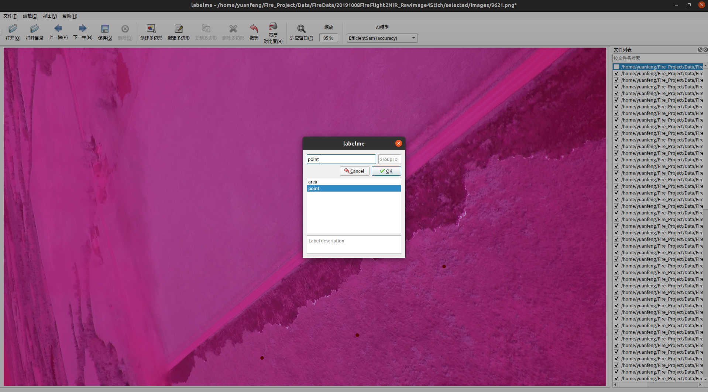

# SAM-based Fire Front Labeling (SFL)

**SFL** (SAM-based Fire Front Labeling) is a semi-automatic fire front annotation framework designed to efficiently generate high-quality fire front labels from aerial images.\
It leverages Meta's **Segment Anything Model (SAM)** and combines it with minimal manual labeling to produce accurate, consistent, reproducible and one-pixel-wide masks for fire modeling (e.g. rate of spread).

<p align="center">
    
</p>

------------------------------------------------------------------------

## 🌎 Environment Setup

### Software Environment

-   Ubuntu 20.04
-   Python 3.9.12
-   CUDA 11.4

### Installation

``` bash
# Create environment
conda create -n sfl python=3.9.12 (or any other version)
conda activate sfl

# Install dependencies
pip install -r requirements.txt
```

Typical dependencies (listed in `requirements.txt`):

    torch
    torchvision
    segment-anything
    opencv-python
    numpy
    matplotlib
    tqdm

You will also need to download the **SAM checkpoint** (pth file) from Google Drive:
[SAM ViT-B Checkpoint](https://drive.google.com/file/d/1B3ROeN8_IpqSiSN32Jwv_bvbSIOxhpMe/view?usp=drive_link)

After downloading, extract and place it under:
``` bash
checkpoints/sam_vit_b_01ec64.pth
```

------------------------------------------------------------------------

## 🧰 Tools

### Labelme

Manual selection of **prompt points** and **range** are required with [Labelme](https://labelme.io/).

Install Labelme:

``` bash
pip install labelme
```

To start labeling:

``` bash
labelme
```

### Manual Selection Example

Below shows example of manual selecting prompt points and range using **Labelme**:

**Prompt Points Selection**: Shape Type -- **Point**; Group ID -- **point**; randomly click among **unburned area**.

<p align="center">
    
</p>

**Range Selection**: Shape Type -- **Rectangle**; Group ID -- **area**; cover fire front only.

<p align="center">
    
</p>

------------------------------------------------------------------------

## ✍️ Manual Selection Protocol

Manual selection provides the basic information for fire front label generation. And also used for label refinement.

**Guidelines:**\
1. Select **prompt points** and **fire front range** as the previous examples.
2. Save JSON files following the same name as the corresponding image:\
    - Example: `9621.jpg → 9621.json`


**Directory structure:**

    dataset/
    ├── images/
    │   ├── 9621.png
    │   ├── 9621.json
    │   └── ...

------------------------------------------------------------------------

## 🔧 Creating New Labels with SAM

Use the provided Python script `create_sfl_labels.py` to automatically
generate fire front masks using SAM and the manual initialization lines.

### Example Usage

``` bash
python create_sfl_labels.py     --input_dir dataset/images     --label_dir dataset/labels     --output_dir dataset/sfl_masks     --sam_checkpoint path/to/sam_vit_h_4b8939.pth     --device cuda
```

### Script Overview (`create_sfl_labels.py`)

``` python
import os
import torch
import cv2
from segment_anything import sam_model_registry, SamPredictor

def generate_sfl_masks(image_path, label_json, sam_checkpoint):
    sam = sam_model_registry["vit_h"](checkpoint=sam_checkpoint)
    predictor = SamPredictor(sam)
    # Load image and manual hints (Labelme JSON)
    # Predict masks using SAM and merge overlapping ones
    # Save merged mask as .png
```

The script merges multiple overlapping masks into a **single clean mask
per region**, ensuring: - Sharp and continuous fire front boundaries -
Removal of redundant overlapping edges - Preservation of large, distinct
regions

------------------------------------------------------------------------

## 📦 Output Example

    dataset/
    ├── sfl_masks/
    │   ├── IMG_001_mask.png
    │   ├── IMG_002_mask.png
    │   └── ...

------------------------------------------------------------------------

## 📘 Citation

If you use SFL in your work, please cite:

    @misc{SFL2025,
      title = {SAM-based Fire Front Labeling (SFL)},
      author = {Yuan, F.},
      year = {2025},
      howpublished = {GitHub Repository},
      note = {https://github.com/<your-repo>}
    }

------------------------------------------------------------------------

## 💬 Contact

For questions or collaboration, please contact:\
**Yuan F.**\
📧 \[your.email@domain.edu\]\
🌐 \[your website or lab link\]
